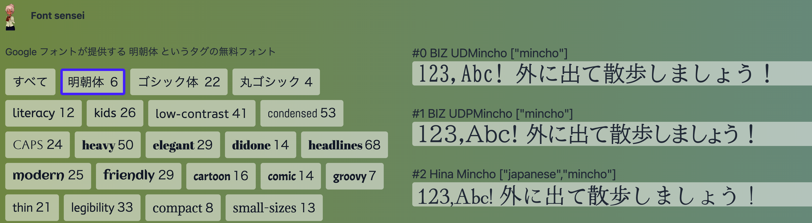

# Font sensei - Google fonts categorized by tag names

Font sensei is a Google fonts picker categorized by tag names.



View on https://fontsensei.com

## Features
- Readable tags on the left for easy font discovery.
- Tags for non-Latin languages, eg CJK(Chinese, Japanese, Korean), in their corresponding native language
- Easy on the eye coloring for both day & night.

## Structure
- src/@fontsensei contains the core code of this repo.
  - src/@fontsensei/data is the source data
  - src/@fontsensei/locales is the translation data
- for everything outside src/@fontsensei, it's the demo application with i18n tuned.

## Contribute
- Create a ticket
- Or you can directly edit files on Github if u know how to `src/@fontsensei/data`, `src/@fontsensei/locales`
- Help is needed on all non-Latin fonts!

## Run

```
# .env
NEXT_PUBLIC_DOMAIN_NAME=localhost:3000
```

```bash
yarn dev
```

## Credits

Font source => [Google fonts](https://fonts.google.com)

Latin tag data => [Font Library](https://github.com/katydecorah/font-library)

The logo => [SyntheOtaku](https://syntheotaku.itch.io/anime-teacher-sprite)


## CJK Data Demo
Check the data on UI ->

### [Japanese (ja)](https://fontsensei.com/ja)
- [明朝体 (Mincho)](https://fontsensei.com/ja/tag/mincho)
- [角ゴシック (Kaku Gothic)](https://fontsensei.com/ja/tag/kaku-gothic)
- [丸ゴシック (Maru Gothic)](https://fontsensei.com/ja/tag/maru-gothic)
- [手書き (Tegaki)](https://fontsensei.com/ja/tag/tegaki)
- [毛筆体 (Fude)](https://fontsensei.com/ja/tag/fude)
- [ポップ体 (Poppu)](https://fontsensei.com/ja/tag/poppu)
- [かわいい (Kawaii)](https://fontsensei.com/ja/tag/kawaii)
- [マンガ(Manga)](https://fontsensei.com/ja/tag/manga)

### [Chinese Simplified (zh-cn)](https://fontsensei.com/zh-cn)
- [宋体 (Songti)](https://fontsensei.com/zh-cn/tag/songti)
- [黑体 (Heiti)](https://fontsensei.com/zh-cn/tag/heiti)
- [楷体 (Kaiti)](https://fontsensei.com/zh-cn/tag/kaiti)
- [手写 (Shouxie)](https://fontsensei.com/zh-cn/tag/shouxie)
- [毛笔 (Maobi)](https://fontsensei.com/zh-cn/tag/maobi)
- [美术体 (Meishuti)](https://fontsensei.com/zh-cn/tag/meishuti)

### [Chinese Traditional (zh-tw)](https://fontsensei.com/zh-tw)
- [宋體 (Songti)](https://fontsensei.com/zh-tw/tag/songti)
- [黑體 (Heiti)](https://fontsensei.com/zh-tw/tag/heiti)
- [楷體 (Kaiti)](https://fontsensei.com/zh-tw/tag/kaiti)
- [手寫 (Shouxie)](https://fontsensei.com/zh-tw/tag/shouxie)
- [毛筆 (Maobi)](https://fontsensei.com/zh-tw/tag/maobi)
- [美術體 (Meishuti)](https://fontsensei.com/zh-tw/tag/meishuti)

### [Korean (ko)](https://fontsensei.com/ko)
- [돋움 (Dotum)](https://fontsensei.com/ko/tag/dotum)
- [바탕 (Batang)](https://fontsensei.com/ko/tag/batang)
- [송을씨체 (Songeulssi)](https://fontsensei.com/ko/tag/songeulssi)
- [장식체 (Jangsikche)](https://fontsensei.com/ko/tag/jangsikche)
- [픽셀체 (Piksellche)](https://fontsensei.com/ko/tag/piksellche)
- [고전체 (Gojeonche)](https://fontsensei.com/ko/tag/gojeonche)
- [탈네모 (Talnemo)](https://fontsensei.com/ko/tag/talnemo)
- [캘리폰트 (Kaelriponteu)](https://fontsensei.com/ko/tag/kaelriponteu)
- [코딩체 (Kodingche)](https://fontsensei.com/ko/tag/kodingche)
- [궁서체 (Gungsuhche)](https://fontsensei.com/ko/tag/gungsuhche)

